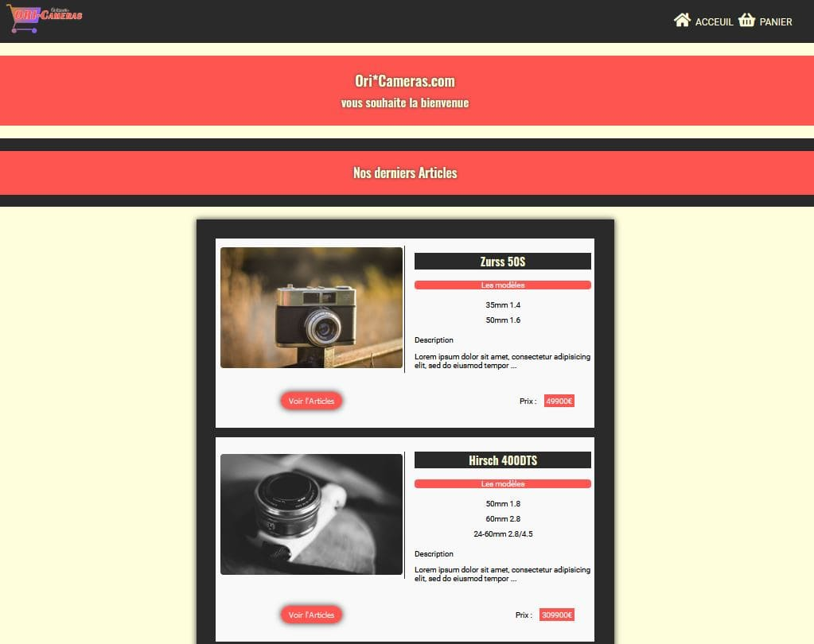
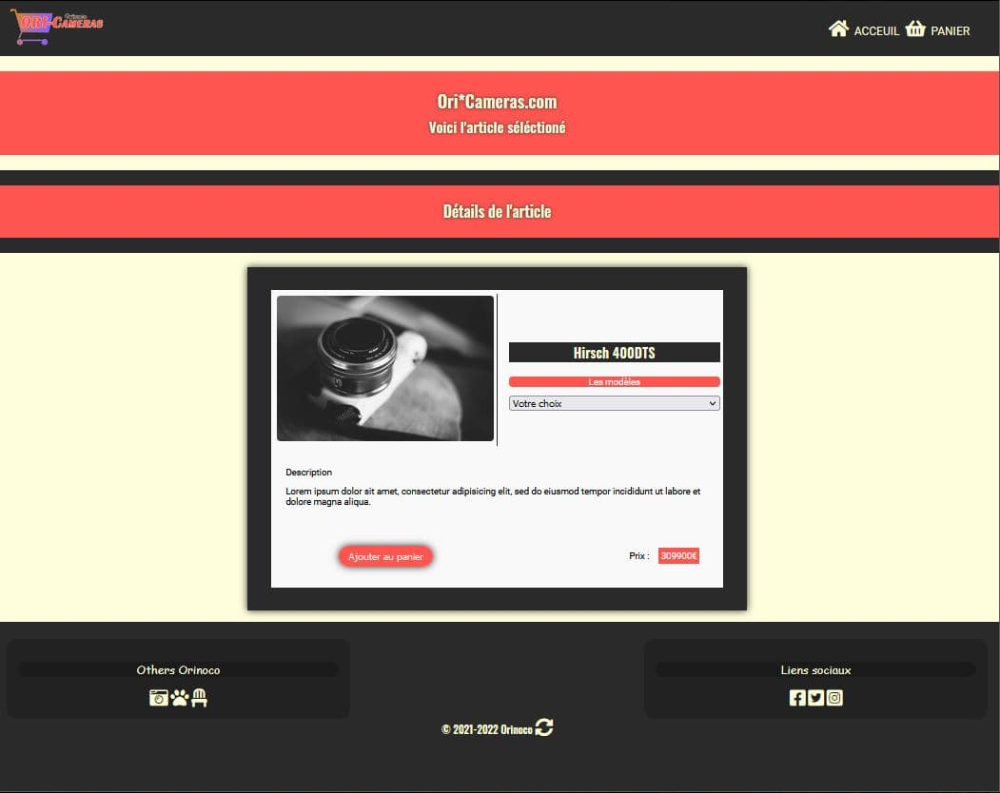
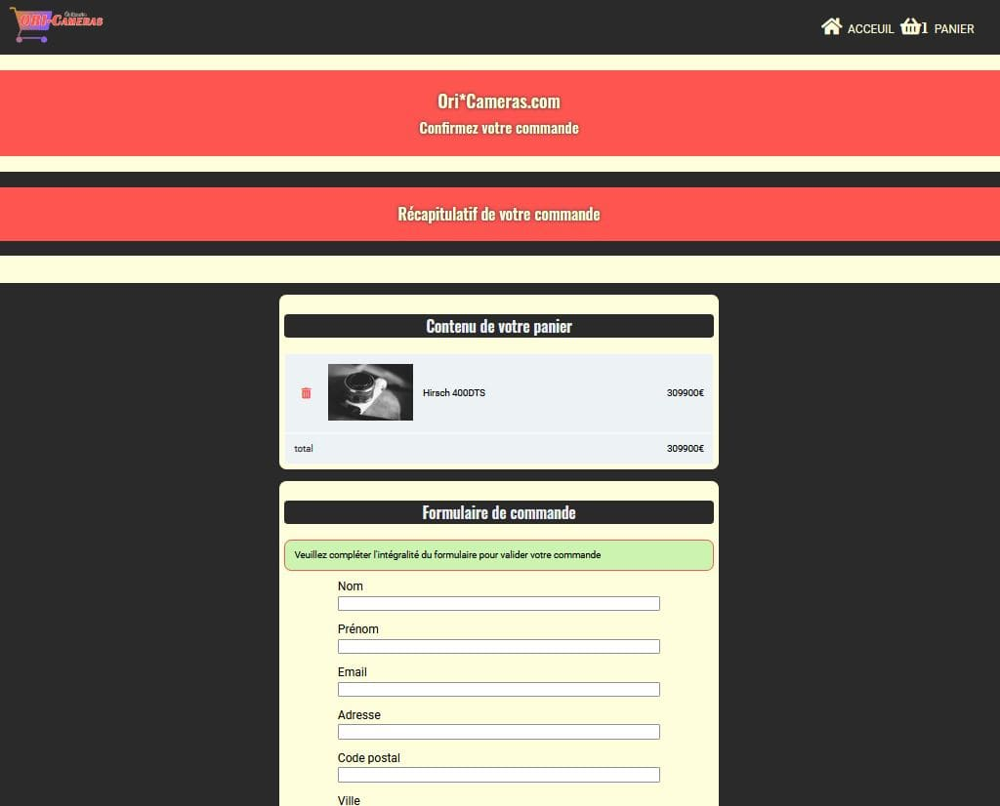
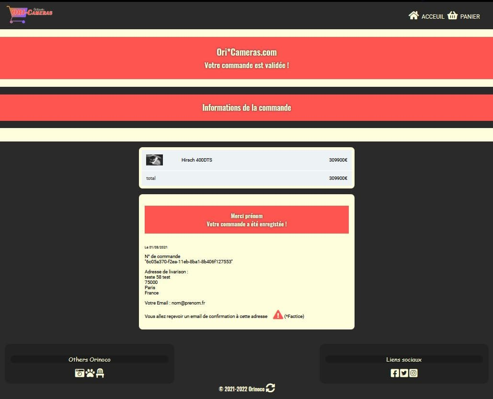
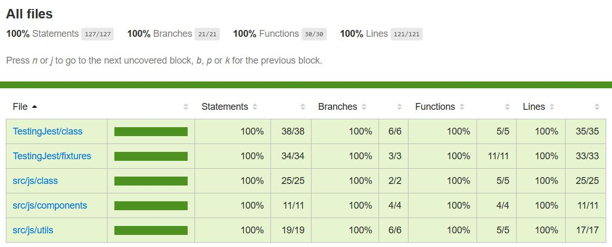

# Construisez un site e-commerce 

## Note préalable :

>### Configuration pour tester l’application
1.	Vous devez d’abord cloner [le repository git ( backend ) ](https://github.com/OpenClassrooms-Student-Center/JWDP5 "le repository git ( backend ) ")du projet qui contient un serveur et les API
>
2.	Lancer le serveur sur le port 3000
>	( L’application est configurée pour utiliser cette route :  http://localhost:3000/api/cameras )
>
3.	Cloner [ce projet (frontend)](https://github.com/Jokdeve-0/GeorgesRamos_5_19072021 "ce projet (frontend)") et installer le package.json
>
4.	Lancer le projet sur un serveur local « port 5500 »
>	( ! si vous utiliser un autre port pensez à configurer `0_config_before_test.js` pour exécuter les tests avec Cypress `<root>/cypress/0_config_before_test.js` )

## Sommaire

-[Architecture générale](#architecture-générale)

-[API](#api)

-[Les outils de développement](#les-outils-de-développement)

-[le plan de test](#le-plan-de-test)

## Architecture générale

>L’application web sera composée de 4 pages :

### une Page d'accueil  "HOME"

une page de vue sous forme de liste, montrant tous les articles disponibles à la vente.

### Une page produit "PRODUCT"

une page “produit”, qui affiche de manière dynamique l'élément sélectionné par l'utilisateur et lui permet de personnaliser le produit et de l'ajouter à son panier.

### Une page panier "BASKET"

une page “panier” contenant un résumé des produits dans le panier, le prix total et un formulaire permettant de passer une commande.

### Une page de validation "VALID"

une page de confirmation de commande, remerciant l'utilisateur pour sa commande, et indiquant le prix total et l'identifiant de commande envoyé par le serveur.

## API

>### Produits présentés : caméras vintage

>URL : http://localhost:3000/api/cameras

>### Paramètres de l’API:

>	GET   « / »	Retourne un tableau de tous les éléments
>
>	GET   « /:_id » Renvoie l'élément correspondant à l’identifiant
>
>	POST « /order » Requête JSON contenant un objet de contact et un tableau de produits & retourne l'objet contact, le tableau produits et orderId (string)

## Les outils de dévelopement

> Langages :

> Dépendances :

> Frameworks de test :

## Le plan de test

### Les tests Cypress

>dir :  `./cypress/integration/`

>`1_homePage.spec.js`
>
>`2_productPage.spec.js`
>
>`3_basketPage.spec.js`
>
>`3.1_formValidation.spec.js`
>
>`4_validation.spec.js`

#### homePage.spec.js

Contexte :

>Sur la page d’accueil lorsque que le document est chargé

Test :

>:heavy_check_mark: Affichage des produits sur le page
>
>:heavy_check_mark: Affichage du nombre de produits avec un panier vide
>
>:heavy_check_mark: Affichage des en-têtes dynamiques
>
>:heavy_check_mark: Sélection du premier produit
>
>:heavy_check_mark: Sélection du dernier produit

#### productPage.spec.js

Contexte :

>Redirection vers la page produit après sélection d'un produit

Test :

>:heavy_check_mark: Affichage du produit sur la page avec une image et un menu des modèles
>
>:heavy_check_mark: Affichage des en-têtes dynamiques
>
>:heavy_check_mark: Ajouter un produit au panier sans préciser de modèle puis préciser le modèle et ajouter au panier
>
>:heavy_check_mark: Ajouter deux produits au panier
>
>:heavy_check_mark: Réinitialiser l'application en vidant le local storage

#### basketPage.spec.js

Contexte :

>Sur la page Panier lorsque le document est chargé

Test :

>:heavy_check_mark: Affichage des en-têtes dynamiques

>:heavy_check_mark: Avec 0 produit dans le panier et le total est de 0€
>
>:heavy_check_mark: Ajouter un produit et observer le total
>
>:heavy_check_mark: Ajouter 3 produits 3 et observer le total
>
>:heavy_check_mark: Supprimer 1 produit dans le panier qui contient 3
>
>:heavy_check_mark: Valider le formulaire avec toutes les entrées vide
>
>:heavy_check_mark: Valider le formulaire avec toutes les entrées valides

#### validation.spec.js

Contexte :

> Redirection vers la page valide après la validation du formulaire

Test :

> :heavy_check_mark: Affichage des en-têtes dynamiques
>
>:heavy_check_mark: L'affichage du récapitulatif des produits commandés
>
>:heavy_check_mark: L'affichage du récapitulatif des informations de la commande

#### formValidation.spec.js

Contexte :

>Vérification de la validité des données erronées transmises dans le formulaire

Test :

>:heavy_check_mark: Avec toutes les entrées avec 1 espace comme valeur
>
>:heavy_check_mark: Avec une erreur dans nom
>
>:heavy_check_mark: Avec une erreur dans prénom
>
>:heavy_check_mark: Avec une erreur dans l'e-mail
>
>:heavy_check_mark: Avec une erreur dans l'adresse
>
>:heavy_check_mark: Avec une erreur dans le code postal
>
>:heavy_check_mark: Avec une erreur dans la ville
>
>:heavy_check_mark: Avec une erreur dans le pays

### Les tests Jest

>dir : `./TestingJest/`

>`Class/APILink.spec.js`
>
>`Class/basket.spec.js`
>
>`Components/components.spec.js`
>
>`Utils/utils.spec.js`

#### APILink.spec.js

Contexte :

>Au démarrage de l'application

test :

>:heavy_check_mark: Instanciation d'une classe APILink
>
>:heavy_check_mark: Récupération de tous les produits
>
>:heavy_check_mark: Récupération de tous les produits avec une erreur
>
>:heavy_check_mark: Récupération d'un produit par identifiant
>
>:heavy_check_mark: Récupération d'un produit avec une erreur d'identifiant
>
>:heavy_check_mark: Récupération d'un produit dans localStorage avec une erreur d’id
>
>:heavy_check_mark: Récupération d'un produit avec une erreur d'url
>
>:heavy_check_mark: Tentative de publication des données correctement formatées
>
>:heavy_check_mark: Tentative de publication de données mal formatées

#### Basket.spec.js

Contexte :

>Implémentation du panier

test :

>:heavy_check_mark: Ajouter 1 produits au panier
>
>:heavy_check_mark: Ajouter 2 produits au panier
>
>:heavy_check_mark: Récupérer un premier produit dans le panier
>
>:heavy_check_mark: Affichage du nombre de produits avec le panier vide
>
>:heavy_check_mark: Affichage du nombre de produits avec 3 produits dans le panier
>
>:heavy_check_mark: Supprimer un produit du panier qui en contiennent 3
>
>:heavy_check_mark: Supprimer un produit du panier vide

Contexte :

>Publier des données sur le serveur

test :

>:heavy_check_mark: Avec des données vides
>
>:heavy_check_mark: Avec des données correctement formatées
>
>:heavy_check_mark: La réponse du serveur

#### components.spec.js

Contexte :

>Utilisation des composants

test :

>:heavy_check_mark: Affichage du présentoir des produits du panier
>
>:heavy_check_mark: Afficher des en-têtes du formulaire 
>
>:heavy_check_mark: Affichage du présentoir à produits
>
>:heavy_check_mark: Afficher les informations de la commande

#### utils.spec.js

Contexte :

>Utilisation des outils

test :

> :heavy_check_mark: Calcule le total
>
 >:heavy_check_mark: Récupère une variable dans l'URL et définir la page actuelle

## Code coverage

